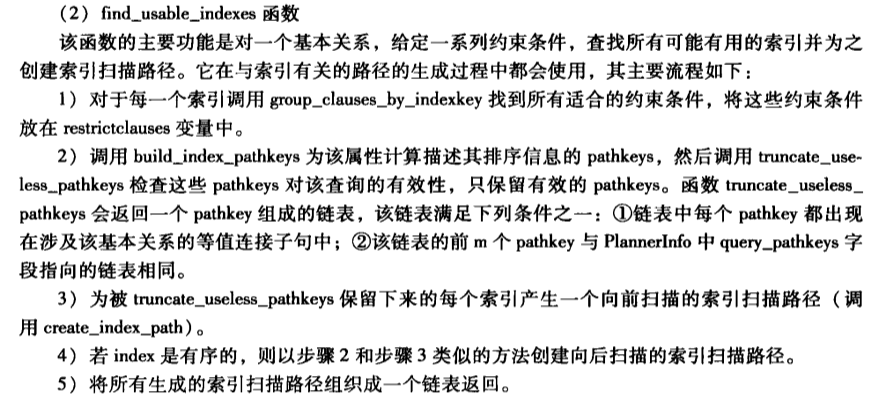

#1. find_usable_indexes

```cpp
/*----------
 * find_usable_indexes
 *    Given a list of restriction clauses, find all the potentially usable
 *    indexes for the given relation, and return a list of IndexPaths.
 *
 * The caller actually supplies two lists of restriction clauses: some
 * "current" ones and some "outer" ones.  Both lists can be used freely
 * to match keys of the index, but an index must use at least one of the
 * "current" clauses to be considered usable.  The motivation for this is
 * examples like
 *      WHERE (x = 42) AND (... OR (y = 52 AND z = 77) OR ....)
 * While we are considering the y/z subclause of the OR, we can use "x = 42"
 * as one of the available index conditions; but we shouldn't match the
 * subclause to any index on x alone, because such a Path would already have
 * been generated at the upper level.  So we could use an index on x,y,z
 * or an index on x,y for the OR subclause, but not an index on just x.
 * When dealing with a partial index, a match of the index predicate to
 * one of the "current" clauses also makes the index usable.
 *
 * If istoplevel is true (indicating we are considering the top level of a
 * rel's restriction clauses), we will include indexes in the result that
 * have an interesting sort order, even if they have no matching restriction
 * clauses.
 *
 * 'rel' is the relation for which we want to generate index paths
 * 'clauses' is the current list of clauses (RestrictInfo nodes)
 * 'outer_clauses' is the list of additional upper-level clauses
 * 'istoplevel' is true if clauses are the rel's top-level restriction list
 *      (outer_clauses must be NIL when this is true)
 * 'outer_rel' is the outer side of the join if forming an inner indexscan
 *      (so some of the given clauses are join clauses); NULL if not
 * 'saop_control' indicates whether ScalarArrayOpExpr clauses can be used
 * 'scantype' indicates whether we need plain or bitmap scan support
 *
 * Note: check_partial_indexes() must have been run previously.
 *----------
 */
static List *
find_usable_indexes(PlannerInfo *root, RelOptInfo *rel,
                    List *clauses, List *outer_clauses,
                    bool istoplevel, RelOptInfo *outer_rel,
                    SaOpControl saop_control, ScanTypeControl scantype)

```


#2.notes
