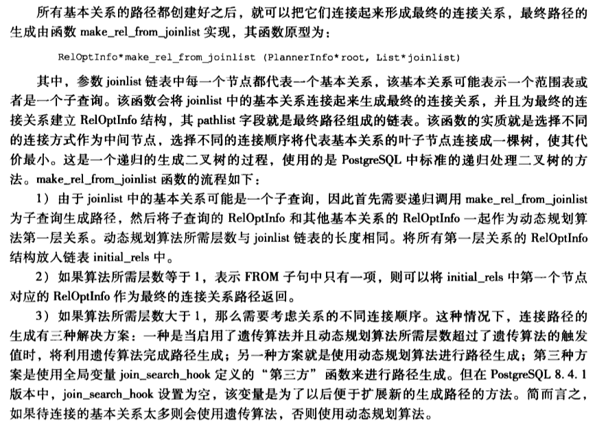

#1.make_rel_from_joinlist

```cpp
/*
 * make_rel_from_joinlist
 *    Build access paths using a "joinlist" to guide the join path search.
 *
 * See comments for deconstruct_jointree() for definition of the joinlist
 * data structure.
 */
static RelOptInfo *
make_rel_from_joinlist(PlannerInfo *root, List *joinlist)
```

#2.notes

