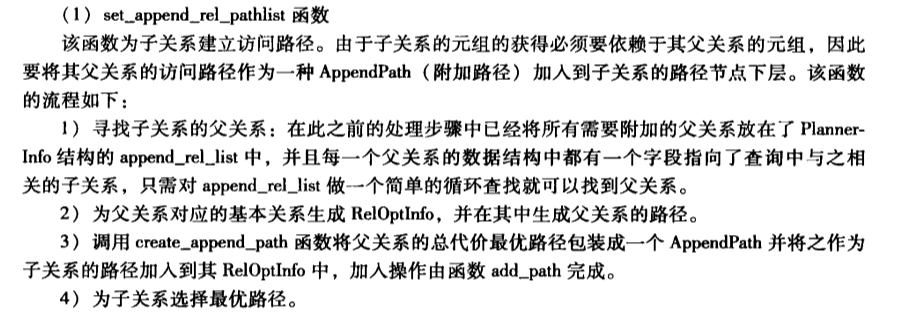

#1.set_append_rel_pathlist

```cpp

/*
 * set_append_rel_pathlist
 *    Build access paths for an "append relation"
 *
 * The passed-in rel and RTE represent the entire append relation.  The
 * relation's contents are computed by appending together the output of
 * the individual member relations.  Note that in the inheritance case,
 * the first member relation is actually the same table as is mentioned in
 * the parent RTE ... but it has a different RTE and RelOptInfo.  This is
 * a good thing because their outputs are not the same size.
 */
static void
set_append_rel_pathlist(PlannerInfo *root, RelOptInfo *rel,
                        Index rti, RangeTblEntry *rte)
```

#2.notes
