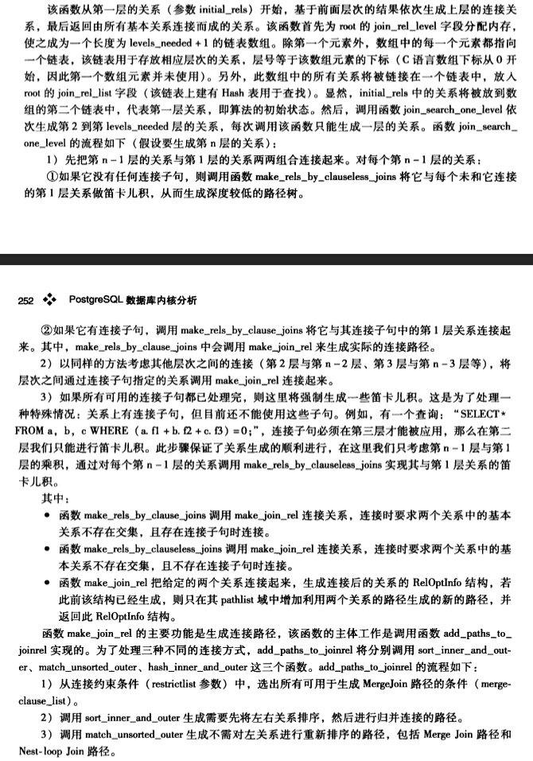

#1.standard_join_search

```cpp
/*
 * standard_join_search
 *    Find possible joinpaths for a query by successively finding ways
 *    to join component relations into join relations.
 *
 * 'levels_needed' is the number of iterations needed, ie, the number of
 *      independent jointree items in the query.  This is > 1.
 *
 * 'initial_rels' is a list of RelOptInfo nodes for each independent
 *      jointree item.  These are the components to be joined together.
 *      Note that levels_needed == list_length(initial_rels).
 *
 * Returns the final level of join relations, i.e., the relation that is
 * the result of joining all the original relations together.
 * At least one implementation path must be provided for this relation and
 * all required sub-relations.
 *
 * To support loadable plugins that modify planner behavior by changing the
 * join searching algorithm, we provide a hook variable that lets a plugin
 * replace or supplement this function.  Any such hook must return the same
 * final join relation as the standard code would, but it might have a
 * different set of implementation paths attached, and only the sub-joinrels
 * needed for these paths need have been instantiated.
 *
 * Note to plugin authors: the functions invoked during standard_join_search()
 * modify root->join_rel_list and root->join_rel_hash.  If you want to do more
 * than one join-order search, you'll probably need to save and restore the
 * original states of those data structures.  See geqo_eval() for an example.
 */
RelOptInfo *
standard_join_search(PlannerInfo *root, int levels_needed, List *initial_rels)
```

#2.notes

