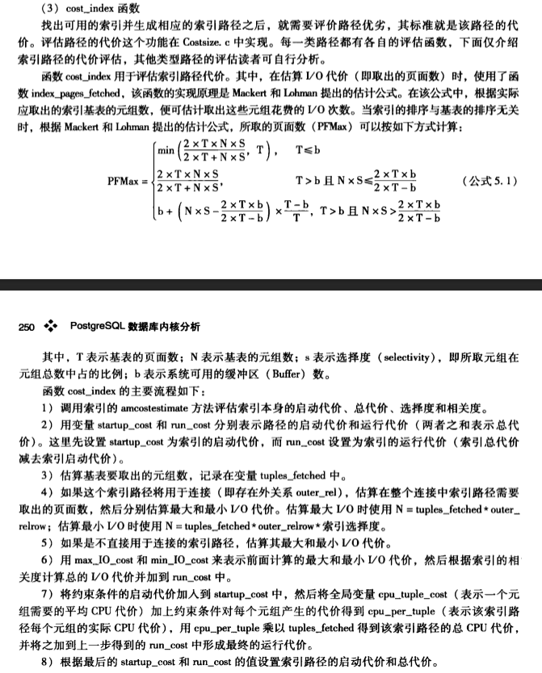

#1.cost_index

```cpp
/*
 * cost_index
 *    Determines and returns the cost of scanning a relation using an index.
 *
 * 'index' is the index to be used
 * 'indexQuals' is the list of applicable qual clauses (implicit AND semantics)
 * 'outer_rel' is the outer relation when we are considering using the index
 *      scan as the inside of a nestloop join (hence, some of the indexQuals
 *      are join clauses, and we should expect repeated scans of the index);
 *      NULL for a plain index scan
 *
 * cost_index() takes an IndexPath not just a Path, because it sets a few
 * additional fields of the IndexPath besides startup_cost and total_cost.
 * These fields are needed if the IndexPath is used in a BitmapIndexScan.
 *
 * NOTE: 'indexQuals' must contain only clauses usable as index restrictions.
 * Any additional quals evaluated as qpquals may reduce the number of returned
 * tuples, but they won't reduce the number of tuples we have to fetch from
 * the table, so they don't reduce the scan cost.
 *
 * NOTE: as of 8.0, indexQuals is a list of RestrictInfo nodes, where formerly
 * it was a list of bare clause expressions.
 */
void
cost_index(IndexPath *path, PlannerInfo *root,
           IndexOptInfo *index,
           List *indexQuals,
           RelOptInfo *outer_rel)
```

#2.notes

