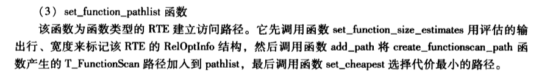

#1.set_function_pathlist

```cpp
/*
 * set_function_pathlist
 *      Build the (single) access path for a function RTE
 */
static void
set_function_pathlist(PlannerInfo *root, RelOptInfo *rel, RangeTblEntry *rte)
```

#2.notes

