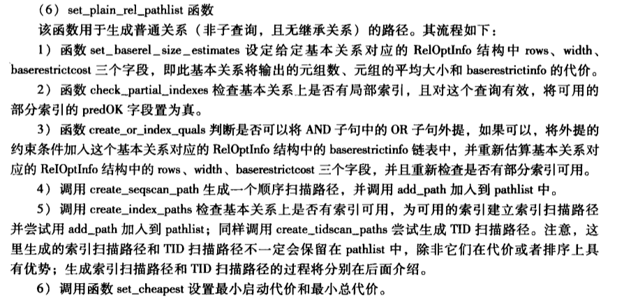

#1.set_plain_rel_pathlist

```cpp
/*
 * set_plain_rel_pathlist
 *    Build access paths for a plain relation (no subquery, no inheritance)
 */
static void
set_plain_rel_pathlist(PlannerInfo *root, RelOptInfo *rel, RangeTblEntry *rte)
```

#2.notes
