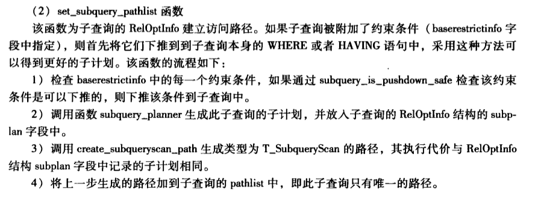

#1.set_subquery_pathlist

```cpp
/*
 * set_subquery_pathlist
 *      Build the (single) access path for a subquery RTE
 */
static void
set_subquery_pathlist(PlannerInfo *root, RelOptInfo *rel,
                      Index rti, RangeTblEntry *rte)
```

#2.notes

