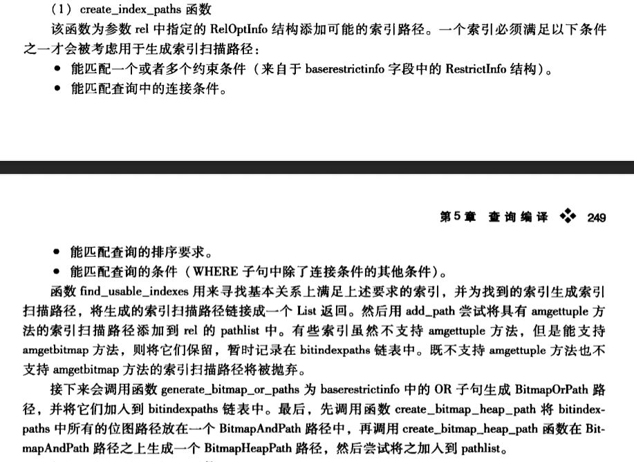

#1.create_index_path

```cpp
/*
 * create_index_path
 *    Creates a path node for an index scan.
 *
 * 'index' is a usable index.
 * 'clause_groups' is a list of lists of RestrictInfo nodes
 *          to be used as index qual conditions in the scan.
 * 'pathkeys' describes the ordering of the path.
 * 'indexscandir' is ForwardScanDirection or BackwardScanDirection
 *          for an ordered index, or NoMovementScanDirection for
 *          an unordered index.
 * 'outer_rel' is the outer relation if this is a join inner indexscan path.
 *          (pathkeys and indexscandir are ignored if so.)  NULL if not.
 *
 * Returns the new path node.
 */
IndexPath *
create_index_path(PlannerInfo *root,
                  IndexOptInfo *index,
                  List *clause_groups,
                  List *pathkeys,
                  ScanDirection indexscandir,
                  RelOptInfo *outer_rel)

```

#2.notes
